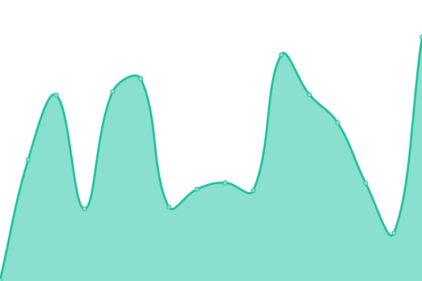

# [📈 Live Status](https://apercallc.github.io/apercallc-upptime): <!--live status--> **🟩 All systems operational**

This repository contains the official uptime monitoring and status page for [Aperca LLC](https://apercallc.com), powered by [Upptime](https://github.com/upptime/upptime).

## 🔍 System Monitoring

Our monitoring system provides real-time insights into the performance and availability of all Aperca LLC services. We continuously monitor our infrastructure to ensure optimal service delivery and rapid incident response.

With [Upptime](https://upptime.js.org), we maintain a comprehensive uptime monitoring system that provides transparency into our service reliability. We use [Issues](https://github.com/apercallc/apercallc-upptime/issues) as incident reports, [Actions](https://github.com/apercallc/apercallc-upptime/actions) as automated monitoring, and [Pages](https://apercallc.github.io/apercallc-upptime) for our public status page.

## 📊 Service Status Overview

<!--start: status pages-->
<!-- This summary is generated by Upptime (https://github.com/upptime/upptime) -->
<!-- Do not edit this manually, your changes will be overwritten -->
<!-- prettier-ignore -->
| URL | Status | History | Response Time | Uptime |
| --- | ------ | ------- | ------------- | ------ |
|  [Aperca LLC Website](https://apercallc.com) | 🟩 Up | [aperca-llc-website.yml](https://github.com/apercallc/apercallc-upptime/commits/HEAD/history/aperca-llc-website.yml) | 

 415ms
     
 | 

<a href="https://apercallc.github.io/apercallc-upptime/history/aperca-llc-website">100.00%</a>
    

|  [Hostinger](https://www.hostinger.com/) | 🟩 Up | [hostinger.yml](https://github.com/apercallc/apercallc-upptime/commits/HEAD/history/hostinger.yml) | 

 264ms
     
 | 

<a href="https://apercallc.github.io/apercallc-upptime/history/hostinger">100.00%</a>
    

|  [Squarespace](https://www.squarespace.com/) | 🟩 Up | [squarespace.yml](https://github.com/apercallc/apercallc-upptime/commits/HEAD/history/squarespace.yml) | 

 236ms
     
 | 

<a href="https://apercallc.github.io/apercallc-upptime/history/squarespace">100.00%</a>
    

|  [Imgur](https://imgur.com/) | 🟩 Up | [imgur.yml](https://github.com/apercallc/apercallc-upptime/commits/HEAD/history/imgur.yml) | 

 104ms
     
 | 

<a href="https://apercallc.github.io/apercallc-upptime/history/imgur">100.00%</a>
    

<!--end: status pages-->

[**Visit our status website →**](https://apercallc.github.io/apercallc-upptime)

## 🚨 Incident Reporting

If you experience any issues with our services that are not reflected on this status page, please:

1. Check our [status page](https://apercallc.github.io/apercallc-upptime) for current incidents
2. Report issues through our [support channels](https://apercallc.com/contact.php)
3. Follow us for real-time updates during maintenance windows

## 📈 Performance Metrics

Our monitoring system tracks:

- **Response Times**: Average response times across all monitored endpoints
- **Uptime Percentage**: Historical uptime statistics for all services
- **Incident History**: Complete timeline of past incidents and resolutions
- **Performance Trends**: Long-term performance analysis and capacity planning

## 📄 License & Attribution

- **Monitoring System**: Powered by [Upptime](https://github.com/upptime/upptime)
- **Code License**: [MIT](./LICENSE) © [Anand Chowdhary](https://anandchowdhary.com), supported by [Pabio](https://pabio.com)
- **Monitoring Data**: [Open Database License](https://opendatacommons.org/licenses/odbl/1-0/)
- **Service Operations**: © 2025 Aperca LLC. All rights reserved.
